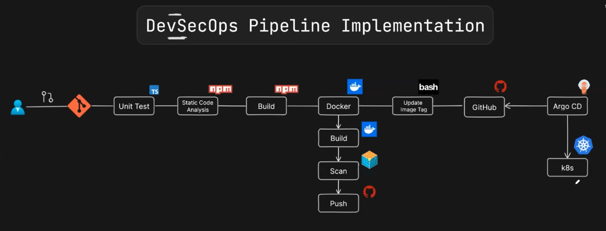
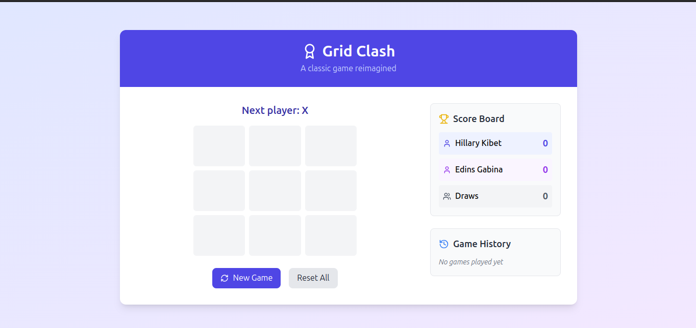

# DevSecOps-CI-CD-Pipeline-Implementation
DevSecOps CI/CD Pipeline Implementation to deploy Tiktactoe Game





Final successfull pipeline deployment outcome:




## Features

- 🎮 Fully functional Tic Tac Toe game
- 📊 Score tracking for X, O, and draws
- 📜 Game history with timestamps
- 🏆 Highlights winning combinations
- 🔄 Reset game and statistics
- 📱 Responsive design for all devices

## Technologies Used

- React 18
- TypeScript
- Tailwind CSS
- Lucide React for icons

## Project Structure

```
src/
├── components/
│   ├── Board.tsx       # Game board component
│   ├── Square.tsx      # Individual square component
│   ├── ScoreBoard.tsx  # Score tracking component
│   └── GameHistory.tsx # Game history component
├── utils/
│   └── gameLogic.ts    # Game logic utilities
├── App.tsx             # Main application component
└── main.tsx           # Entry point
```

## Game Logic

The game implements the following rules:

1. X goes first, followed by O
2. The first player to get 3 of their marks in a row (horizontally, vertically, or diagonally) wins
3. If all 9 squares are filled and no player has 3 marks in a row, the game is a draw
4. Winning combinations are highlighted
5. Game statistics are tracked and displayed